## Proyecto Pruebas automatizadas

Integrantes:
  - Hector Tenezaca
  - Javier López

## Aspectos generales

En el siguiente documento realizamos un proceso de pruebas explorativas a la aplicación [Ghost](https://github.com/TryGhost/Ghost) en su versión **3.41.1**.

La instalación se realizó [utilizando Docker](https://github.com/muniter/TSDC_GHOST/blob/master/build/docker-compose.yaml) usando la imágen publicada en DockerHub.

Ghost ha sido codificado en Javascript a trabaja través del entorno de ejecución nodeJS, para la persistencia usa SQLite y para los estilos CSS. Muestra una arquitectura MVC. La disposición del directorio es la siguiente:

```
 /content
     /...
     /data
     ...
 /core
     /frontend
         /apps
         /services
         /views
         /web
         ...
     /server
         /api
         /data
         /models
         ghost-server.js
         ...
     /shared
     app.js
 /test
    /integration
    /regression
    /unit
```

## Listado de funcionalidades

1. Crear una publicación: Se puede crear una publicación, esta es la unidad mínima de contenido de Ghost, en esta se puede escribir texto en formato markdown, agregar imágenes y demás.
2. Editar una publicación: Se puede editar todos los detalles de una publicación ya creada.
3. Eliminar una publicación: Se puede eliminar una publicación ya creada.
4. Crear una página: Se puede crear una página con menos funcionalidades a un post, pues esta página no tendrá autor, tags, etc.
5. Editar una página: Se puede editar todos los detalles de una página ya creada.
6. Eliminar una página: Se puede eliminar una publicación ya creada.
7. Crear una tag: Se puede crear un tag, este es un elemento de organización bajo agrupación, se provee un nombre, descripción y post asociados.
8. Editar una tag: Se puede editar todos los datos de un tag ya creado.
9. Eliminar una tag: Se puede eliminar un tag ya creado.
10. Crear un member: Se crean los miembros de la página, aquellos que están suscritos a su contenido, se provee un nombre, correo y labels.
11. Editar un member: Se puede editar todos los datos de un member ya creado.
12. Eliminar un member: Se puede eliminar un member ya creado.
13. Crear un staff: Se crean los staff de la página, aquellos que escriben contenido en la página, se provee un nombre, correo, password, etc.
14. Editar un staff: Se puede editar todos los datos de un staff ya creado.
15. Eliminar un staff: Se puede eliminar todos los datos de un staff ya creado.

<div style="page-break-after: always"></div>

## Inventario de Pruebas

Se realizaron en total 44 pruebas explorativas, que se pueden encontrar [en el formato suministrado](https://docs.google.com/spreadsheets/d/1PjMKYqfaZKyQ-eG3yl1oze4ZOU-kfDWR2E8D86GBfUk/edit?usp=sharing). Esta información también se encuenta como **Anexo 1** al final de este documento.

## Registro de defectos

Se utilizó un [repositorio de Github](https://github.com/muniter/TSDC_GHOST/issues) para esta tarea. Donde se encontraron múltiples defectos:

Link para sistema de registro de incidencias: [Link](https://github.com/muniter/TSDC_GHOST/issues)

En este se encuentran cada una de las pruebas con un mismo formato, donde se explican el comportamiento actual, el comportamiento esperado, los pasos para reproducir, un video que demuestra el error, y la descripción del ambiente de ejecución.

Las pruebas para estos defectos también se encuentran en el formato de pruebas explorativas.

<div style="page-break-after: always"></div>

## Modelo de GUI

**Leyenda**:
  * M: Manage section
  * S: Settings section
  * SF: Site Front



<div style="page-break-after: always"></div>

### Imágenes de los nodos

1. [Login Form](https://github.com/muniter/TSDC_GHOST/blob/master/assets/Login%20Form.png)
1. [Site Front](https://github.com/muniter/TSDC_GHOST/blob/master/assets/Site%20Front.png)
1. [SF: Home](https://github.com/muniter/TSDC_GHOST/blob/master/assets/SF%3A%20Home.png)
1. [SF: Tag](https://github.com/muniter/TSDC_GHOST/blob/master/assets/SF%3A%20Tag.png)
1. [SF: Author](https://github.com/muniter/TSDC_GHOST/blob/master/assets/SF%3A%20Author.png)
1. [Admin Dashboard](https://github.com/muniter/TSDC_GHOST/blob/master/assets/Admin%20Dashboard.png)
1. [M: Post List](https://github.com/muniter/TSDC_GHOST/blob/master/assets/M%3A%20Post%20List.png)
1. [M: Pages List](https://github.com/muniter/TSDC_GHOST/blob/master/assets/M%3A%20Pages%20List.png)
1. [M: Tags List](https://github.com/muniter/TSDC_GHOST/blob/master/assets/M%3A%20Tags%20List.png)
1. [M: Members List](https://github.com/muniter/TSDC_GHOST/blob/master/assets/M%3A%20Members%20List.png)
1. [M: Staff List](https://github.com/muniter/TSDC_GHOST/blob/master/assets/M%3A%20Staff%20List.png)
1. [M: Content Editor](https://github.com/muniter/TSDC_GHOST/blob/master/assets/M%3A%20Content%20Editor.png)
1. [M: Content Settings](https://github.com/muniter/TSDC_GHOST/blob/master/assets/M%3A%20Content%20Settings.png)
1. [M: Staff Editor](https://github.com/muniter/TSDC_GHOST/blob/master/assets/M%3A%20Staff%20Editor.png)
1. [M: Member Editor](https://github.com/muniter/TSDC_GHOST/blob/master/assets/M%3A%20Member%20Editor.png)
1. [M: Tags Settings](https://github.com/muniter/TSDC_GHOST/blob/master/assets/M%3A%20Tags%20Settings.png)
1. [S: General](https://github.com/muniter/TSDC_GHOST/blob/master/assets/S%3A%20General.png)
1. [S: Design](https://github.com/muniter/TSDC_GHOST/blob/master/assets/S%3A%20Design.png)
1. [S: Code injection](https://github.com/muniter/TSDC_GHOST/blob/master/assets/S%3A%20Code%20injection.png)
1. [S: Integrations](https://github.com/muniter/TSDC_GHOST/blob/master/assets/S%3A%20Integrations.png)
1. [S: Labs](https://github.com/muniter/TSDC_GHOST/blob/master/assets/S%3A%20Labs.png)
1. [S: Integrations Settings Individual View](https://github.com/muniter/TSDC_GHOST/blob/master/assets/S%3A%20Integrations%20Settings%20Individual%20View.png)

<div style="page-break-after: always"></div>

## Modelo de dominio

### Glosario

| Nombre                                                                                                           | Tipo        | Descripción                                                  |
| ---------------------------------------------------------------------------------------------------------------- | ----------- | ------------------------------------------------------------ |
| [Member](https://app.genmymodel.com/api/dictionary/projects/_w-AGELHSEeyVi7WGkDHboQ/_ycdxYJQAEDqrStFtVYmCyw)     | Class       | Suscriptores                                                 |
| [Post](https://app.genmymodel.com/api/dictionary/projects/_w-AGELHSEeyVi7WGkDHboQ/_ycYR0JQAEDqrStFtVYmCyw)       | Class       | Publicaciones que se hacen en el producto                    |
| [Product](https://app.genmymodel.com/api/dictionary/projects/_w-AGELHSEeyVi7WGkDHboQ/_yce_gZQAEDqrStFtVYmCyw)    | Class       | Sitio Web                                                    |
| [Role](https://app.genmymodel.com/api/dictionary/projects/_w-AGELHSEeyVi7WGkDHboQ/_ycOg0JQAEDqrStFtVYmCyw)       | Class       | La posición que desempeña en creación o edición del producto |
| [Role](https://app.genmymodel.com/api/dictionary/projects/_w-AGELHSEeyVi7WGkDHboQ/_ycSLMJQAEDqrStFtVYmCyw)       | Enumeration |                                                              |
| [Tag](https://app.genmymodel.com/api/dictionary/projects/_w-AGELHSEeyVi7WGkDHboQ/_ycbVIJQAEDqrStFtVYmCyw)        | Class       | Como se etiqueta a una publicación                           |
| [Type](https://app.genmymodel.com/api/dictionary/projects/_w-AGELHSEeyVi7WGkDHboQ/_yccjQpQAEDqrStFtVYmCyw)       | Enumeration |                                                              |
| [User](https://app.genmymodel.com/api/dictionary/projects/_w-AGELHSEeyVi7WGkDHboQ/_ycUncZQAEDqrStFtVYmCyw)       | Class       | Usuario que puede tener diferentes roles                     |
| [Visibility](https://app.genmymodel.com/api/dictionary/projects/_w-AGELHSEeyVi7WGkDHboQ/_ycUAYZQAEDqrStFtVYmCyw) | Enumeration |

<div style="page-break-after: always"></div>

### Diagrama de clases

Módelo informativo del sistema.


<div style="page-break-after: always"></div>

## Anexos

*Siguiente página*

1. Formato de pruebas explorativas.
