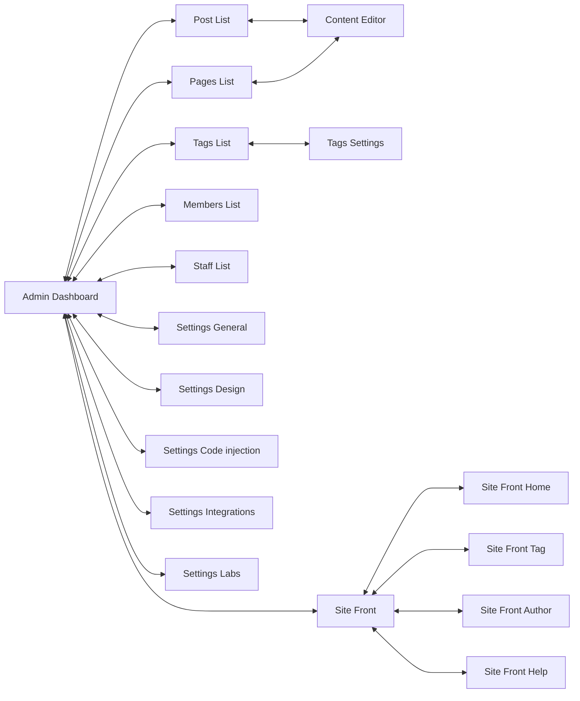

# Proyecto Pruebas automatizadas

**This is an educational assignment**

En el siguiente documento realizamos un proceso de pruebas explorativas a la aplicación [Ghost](https://github.com/TryGhost/Ghost) en su versión **3.41.1**.

## Aspectos generales

La instalación se realizó [utilizando Docker](https://github.com/muniter/TSDC_GHOST/blob/master/build/docker-compose.yaml) usando la imágen publicada en DockerHub.

## Registro de defectos

Se utilizó un [repositorio de Github](https://github.com/muniter/TSDC_GHOST/issues) para esta tarea. Donde se encontraron múltiples defectos:

Link para sistema de registro de incidencias: [Link](https://github.com/muniter/TSDC_GHOST/issues)

En este se encuentran cada una de las pruebas con un mismo formato, donde se explican el comportamiento actual, el comportamiento esperado, los pasos para reproducir, un video que demuestra el error, y la descripción del ambiente de ejecución.

## Inventario de Pruebas

TODO: Cada uno de los issues presentados es una prueba, además de estas necesitamos **pruebas positivas** donde todo salga bien.

## Modelo de GUI

TODO: Un diagrama con nodos (vistas) y aristas (transiciones) usando [mermaid](https://mermaid-js.github.io/mermaid/#/flowchart?id=node-shapes)

TODO: Screenshot for each of the nodes linked here.

