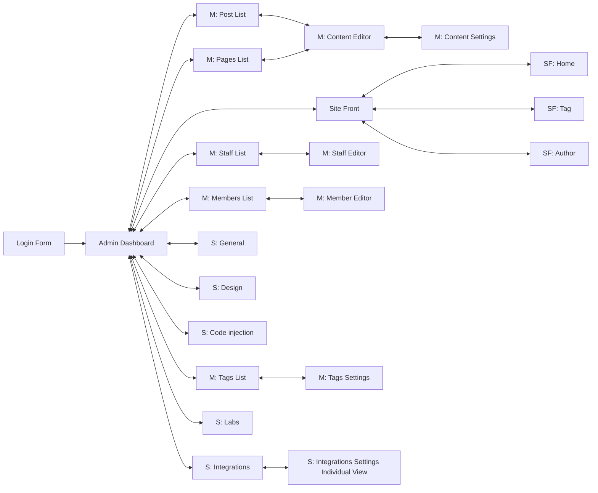

# Proyecto Pruebas automatizadas

**This is an educational assignment**

En el siguiente documento realizamos un proceso de pruebas explorativas a la aplicación [Ghost](https://github.com/TryGhost/Ghost) en su versión **3.41.1**.

## Aspectos generales

La instalación se realizó [utilizando Docker](https://github.com/muniter/TSDC_GHOST/blob/master/build/docker-compose.yaml) usando la imágen publicada en DockerHub.

Ghost ha sido codificado en Javascript a trabaja través del entorno de ejecucion nodeJS, para la persistencia usa SQLite y para los estilos CSS. Muestra una arquitectura MVC. La disposición del directorio es la siguiente:

* /content
    * /...
    * /data
    * ...
* /core
    * /frontend
        * /apps
        * /services
        * /views
        * /web
        * ...
    * /server
        * /api
        * /data
        * /models
        * ghost-server.js
        * ...
    * /shared
    * app.js
* /test
   * /integration
   * /regression
   * /unit
   * ...

## Listado de funcionalidades

1. Crear una publicación
2. Editar una publicación
3. Eliminar una publicación
4. Crear una página
5. Editar una página
6. Eliminar una página
7. Crear una tag
8. Editar una tag
9. Eliminar una tag
10. Crear un member
11. Editar un member
12. Eliminar un member
13. Crear un staff
14. Editar un staff
15. Eliminar un staff

## Registro de defectos

Se utilizó un [repositorio de Github](https://github.com/muniter/TSDC_GHOST/issues) para esta tarea. Donde se encontraron múltiples defectos:

Link para sistema de registro de incidencias: [Link](https://github.com/muniter/TSDC_GHOST/issues)

En este se encuentran cada una de las pruebas con un mismo formato, donde se explican el comportamiento actual, el comportamiento esperado, los pasos para reproducir, un video que demuestra el error, y la descripción del ambiente de ejecución.

## Inventario de Pruebas

TODO: Cada uno de los issues presentados es una prueba, además de estas necesitamos **pruebas positivas** donde todo salga bien.

TODO: Se debe llenar el formato excel entregado, quizás podríamos hacer una tabla en Markdown con la info:

## Modelo de GUI

TODO: Un diagrama con nodos (vistas) y aristas (transiciones) usando [mermaid](https://mermaid-js.github.io/mermaid/#/flowchart?id=node-shapes)

TODO: Screenshot for each of the nodes linked here.

**Leyenda**:
  * M: Manage section
  * S: Settings section
  * SF: Site Front

### Imágenes de los nodos

1. [Login Form](.%2Fassets%2FLogin%20Form.png)
1. [Site Front](.%2Fassets%2FSite%20Front.png)
1. [SF: Home](.%2Fassets%2FSF%3A%20Home.png)
1. [SF: Tag](.%2Fassets%2FSF%3A%20Tag.png)
1. [SF: Author](.%2Fassets%2FSF%3A%20Author.png)
1. [Admin Dashboard](.%2Fassets%2FAdmin%20Dashboard.png)
1. [M: Post List](.%2Fassets%2FM%3A%20Post%20List.png)
1. [M: Pages List](.%2Fassets%2FM%3A%20Pages%20List.png)
1. [M: Tags List](.%2Fassets%2FM%3A%20Tags%20List.png)
1. [M: Members List](.%2Fassets%2FM%3A%20Members%20List.png)
1. [M: Staff List](.%2Fassets%2FM%3A%20Staff%20List.png)
1. [M: Content Editor](.%2Fassets%2FM%3A%20Content%20Editor.png)
1. [M: Content Settings](.%2Fassets%2FM%3A%20Content%20Settings.png)
1. [M: Staff Editor](.%2Fassets%2FM%3A%20Staff%20Editor.png)
1. [M: Member Editor](.%2Fassets%2FM%3A%20Member%20Editor.png)
1. [M: Tags Settings](.%2Fassets%2FM%3A%20Tags%20Settings.png)
1. [S: General](.%2Fassets%2FS%3A%20General.png)
1. [S: Design](.%2Fassets%2FS%3A%20Design.png)
1. [S: Code injection](.%2Fassets%2FS%3A%20Code%20injection.png)
1. [S: Integrations](.%2Fassets%2FS%3A%20Integrations.png)
1. [S: Labs](.%2Fassets%2FS%3A%20Labs.png)
1. [S: Integrations Settings Individual View](.%2Fassets%2FS%3A%20Integrations%20Settings%20Individual%20View.png)

## Modelo de dominio
TODO: Un diagrama UML (tipos de datos, entidades) usando [GenMyModel](https://app.genmymodel.com/api/dictionary/projects/_w-AGELHSEeyVi7WGkDHboQ)

| Nombre                                                                                                           | Tipo        | Descripción                                                  |
| ---------------------------------------------------------------------------------------------------------------- | ----------- | ------------------------------------------------------------ |
| [Member](https://app.genmymodel.com/api/dictionary/projects/_w-AGELHSEeyVi7WGkDHboQ/_ycdxYJQAEDqrStFtVYmCyw)     | Class       | Suscriptores                                                 |
| [Post](https://app.genmymodel.com/api/dictionary/projects/_w-AGELHSEeyVi7WGkDHboQ/_ycYR0JQAEDqrStFtVYmCyw)       | Class       | Publicaciones que se hacen en el producto                    |
| [Product](https://app.genmymodel.com/api/dictionary/projects/_w-AGELHSEeyVi7WGkDHboQ/_yce_gZQAEDqrStFtVYmCyw)    | Class       | Sitio Web                                                    |
| [Role](https://app.genmymodel.com/api/dictionary/projects/_w-AGELHSEeyVi7WGkDHboQ/_ycOg0JQAEDqrStFtVYmCyw)       | Class       | La posición que desempeña en creación o edición del producto |
| [Role](https://app.genmymodel.com/api/dictionary/projects/_w-AGELHSEeyVi7WGkDHboQ/_ycSLMJQAEDqrStFtVYmCyw)       | Enumeration |                                                              |
| [Tag](https://app.genmymodel.com/api/dictionary/projects/_w-AGELHSEeyVi7WGkDHboQ/_ycbVIJQAEDqrStFtVYmCyw)        | Class       | Como se etiqueta a una publicación                           |
| [Type](https://app.genmymodel.com/api/dictionary/projects/_w-AGELHSEeyVi7WGkDHboQ/_yccjQpQAEDqrStFtVYmCyw)       | Enumeration |                                                              |
| [User](https://app.genmymodel.com/api/dictionary/projects/_w-AGELHSEeyVi7WGkDHboQ/_ycUncZQAEDqrStFtVYmCyw)       | Class       | Usuario que puede tener diferentes roles                     |
| [Visibility](https://app.genmymodel.com/api/dictionary/projects/_w-AGELHSEeyVi7WGkDHboQ/_ycUAYZQAEDqrStFtVYmCyw) | Enumeration |

