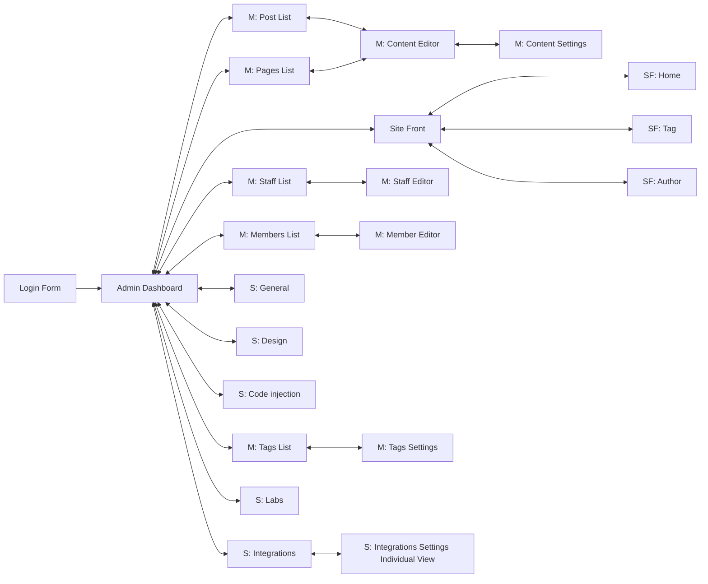

# GUI Diagram

```mermaid
flowchart LR;
    %% Definition of views

    %% Login
    LOG[Login Form]

    %% Front End
    SF[Site Front]
    SFH[SF: Home]
    SFT[SF: Tag]
    SFA[SF: Author]

    %% Admin Dashboard
    DA[Admin Dashboard];

    %% Manage Section
    POL[M: Post List];
    PAL[M: Pages List];
    TAL[M: Tags List];
    MEL[M: Members List];
    STL[M: Staff List];

    %%%% Manage internal views
    POE[M: Content Editor]
    POES[M: Content Settings]
    STE[M: Staff Editor]
    MEE[M: Member Editor]
    TAE[M: Tags Settings]

    %% Settings Section
    SG[S: General]
    SD[S: Design]
    SC[S: Code injection]
    SI[S: Integrations]
    SL[S: Labs]

    %%%% Settings internal views
    SIIV[S: Integrations Settings Individual View]

    %% Links Admin Dashboard

    LOG-->DA
    DA<-->POL
    DA<-->PAL
    DA<-->TAL
    DA<-->MEL
    DA<-->STL
    DA<-->SG
    DA<-->SD
    DA<-->SC
    DA<-->SI
    DA<-->SL
    POL<-->POE
    PAL<-->POE
    POE<-->POES
    STL<-->STE
    TAL<-->TAE
    MEL<-->MEE
    SI<-->SIIV

    %% Links Front End
    DA<--->SF
    SF<--->SFH
    SF<--->SFT
    SF<--->SFA
```
